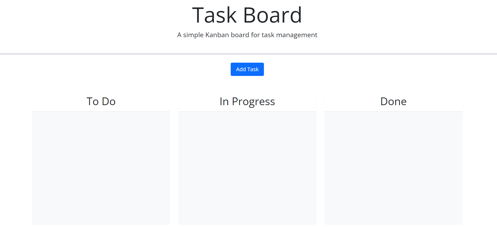
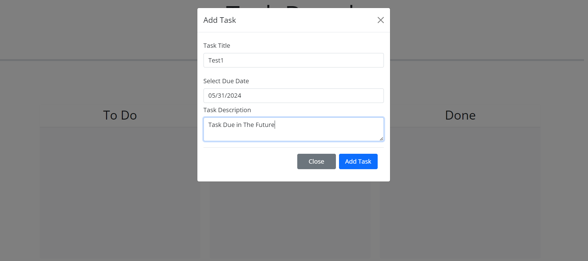
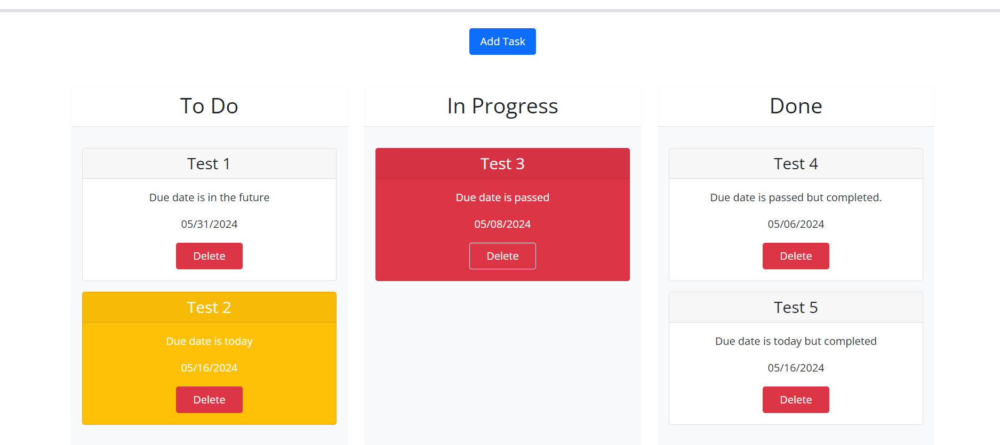

# 05 Third-Party APIs: Task Board
Title: 
Task-Management-App

Description:
In this challenge, I have created a JavaScript file using Jquery and Jquery UIs, Bootstrap UIs to be able to add a task to my to do list and be able to manage my to-dos. When the entered due date becomes greater than today's date, the card turns red for overdue warning. When the entered due date becomes today's date, the card turns yellow to alert the user. When the due date is in the future, card is in its natural state. When card is dragged from anywhere to the 'done' list, the card will reset to its natural color and state. All cards are deletable and even if you refresh or come back to the app in a later date, the to-dos will still be there for updating.
How to Run:
Simply go on to the website click on the "Add Task" button. Fill out the form and click on "Add Task" button to add your task. Your task automatically will show under "to-do" section, but no worries, as you complete this task - you can drag and drop it in to the "in Process" or "done" sections of the app.

Deployed version link: https://minikozort.github.io/Tasks-Management-App/

